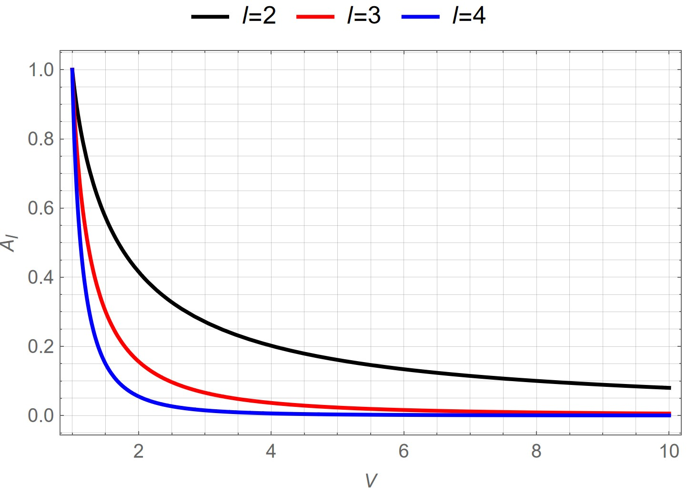

# Vacuum Null Memory Calculator

Perturbative calculators for vacuum nonlinear-null gravitational-wave memory modes.

Includes:

- angular coupling coefficients;
- displacement, spin, and CM memory evaluators;
- leading-order PN helpers for nonprecessing quasicircular compact binaries;
- a bundled `lmax=10` gamma table for common memory-mode targets.

The bundled gamma table lives at `src/vacuum_memory_modes/data/gamma_coeffs_lmax10.npz`. The package loads this file automatically for the example targets, so normal use does not rerun the SymPy/Wigner-3j coefficient generation. If a different `lmax` or target is requested, the code falls back to on-the-fly generation.

## Install

```bash
pip install -e .
```

For the `SEOBNRv5EHM` example, install `pyseobnr` in the same environment. For the `SEOBNRv5EHM`-vs-`NRHybSur3dq8_CCE` example, install both `pyseobnr` and `gwsurrogate`. For the `FastEMRIWaveforms` example, install `fastemriwaveforms`.

The waveform models used by the examples are:

- [`SEOBNRv5EHM` through `pyseobnr`](https://github.com/AEI-ACR/pyseobnr)
- [`NRHybSur3dq8_CCE` through `gwsurrogate`](https://github.com/sxs-collaboration/gwsurrogate)
- [`FastEMRIWaveforms`](https://github.com/BlackHolePerturbationToolkit/FastEMRIWaveforms)

## Example

```bash
python examples/seobnrv5ehm_circular_memory_demo.py
```

The example generates a nonprecessing circular `SEOBNRv5EHM` event, computes $h_{20}$, $h_{30}$, and the leading CM-memory modes, infers an effective 0PN $x$ parameter from the initial $\dot h_{20}$, and compares the initial numerical memory modes with the corresponding leading PN formulas.

The default initial PN parameter is $x_0=0.015$, implemented as `omega_start = 0.015**1.5`. $h_{20}$ and $h_{30}$ panels show the real/imaginary component of $h(t)-h(t_0)$, while CM-memory panels show $|h_{\rm CM}(t)-h_{\rm CM}(t_0)|$.

For CM-memory modes the example prints both:

- the full Nichols leading-PN value; and
- the leading-PN value truncated to the modes actually returned by `pyseobnr`.

This matters because `SEOBNRv5EHM` does not provide every leading PN radiative mode, e.g. it does not provide the $(3,1)$ mode.

Example outputs:

- `examples/output/seobnrv5ehm_circular_memory_q2_omega0.00183712.csv`
- `examples/output/seobnrv5ehm_circular_memory_q2_omega0.00183712.png`

## SEOBNRv5EHM-Vs-NRHybSur3dq8_CCE Example

```bash
python examples/seobnrv5ehm_nrhybsur3dq8_cce_h20_h30_comparison.py
```

This example loads `NRHybSur3dq8_CCE`, finds the `NRHybSur3dq8_CCE` time where $\Omega_{\rm orb}=0.015^{3/2}$, fits the initial `NRHybSur3dq8_CCE` $(2,2)$ phase to get the `SEOBNRv5EHM` `omega_start`, and then compares $h(t)-h(t_0)$ for the `NRHybSur3dq8_CCE` $(2,0)$ and $(3,0)$ modes against `SEOBNRv5EHM` perturbative $h_{20}$ and $h_{30}$.

To use a different oscillatory input model, replace `_generate_pyseobnr_positive_modes` or call `_compute_memory_from_positive_modes` with another nonprecessing positive-$m$ mode dictionary.

Example outputs:

- `examples/output/seobnrv5ehm_nrhybsur3dq8_cce_h20_h30_q2_x0.015.csv`
- `examples/output/seobnrv5ehm_nrhybsur3dq8_cce_h20_h30_q2_x0.015.png`

## FastEMRIWaveforms Example

```bash
python examples/fastemriwaveforms_emri_h20_h30_demo.py
```

This example uses `FastEMRIWaveforms` to generate a circular equatorial Kerr trajectory with mass ratio $q=10^5$ and spin $\chi=0.8$, computes perturbative $h_{20}$ and $h_{30}$ from the oscillatory modes, and compares $h(t)-h(t_0)$ with the same effective-0PN construction used in the `SEOBNRv5EHM` circular example.

Example outputs:

- `examples/output/fastemriwaveforms_emri_h20_h30_q100000_p0_100_chi0p8.csv`
- `examples/output/fastemriwaveforms_emri_h20_h30_q100000_p0_100_chi0p8.png`

## The Rise and Fall of Displacement Memory at Finite Radius

The effective source of null displacement memory is given by the energy-flux model: $[r^2T_{ij}^\text{null}(u=t-r,\mathbf{x}=r\mathbf{n})]=\left(\frac{dE_\text{null}}{dud\Omega_\mathbf{n}}\right)_un_in_j$, with $|\mathbf{n}|=1$ (the model describes the null radiation emitted by a point source), for which a solution to the linearized Einstein equation in a flat background (after TT projection) is
$$
h(t,R,\hat{\mathbf{k}})=\sum_{l,m}h_{l,m}(t,R){}_{-2}Y_{lm}(\hat{\mathbf{k}})=\int_{-\infty}^{t-R}\frac{du}{4\pi(t-u)}\int_\mathbf{n} \frac{16\pi [r^2T_{ij}(u,\mathbf{x}=r\mathbf{n})]\frac{e_{ij}^+(\hat{\mathbf{k}})-ie_{ij}^\times(\hat{\mathbf{k}})}{2}}{1-\left(\frac{R}{t-u}\right)\mathbf{n}\cdot\hat{\mathbf{k}}}.
$$
It follows that
$$
h_{l,m}(t,R)=\int_{-\infty}^{t-R}du\,\frac{4}{t-u}\int_\mathbf{n} \left(\frac{dE_\text{null}}{dud\Omega_\mathbf{n}}\right)_u F_l(v)Y_{lm}^*(\mathbf{n}),
$$
with $v=\frac{R}{t-u}\in(0,1]$ [since $u=t-r<t-R$], and
$$
\begin{equation}
F_l(v)=4\pi\sqrt{\frac{(l-2)!}{(l+2)!}}\frac{(1-v^2)^2}{2v^2}\int_{-1}^1dz \frac{P_l(z)}{(1-vz)^3},
\end{equation}
$$
where $P_l(z)$ denotes the Legendre polynomial of degree $l$. In the null limit, $F_l(1)=4\pi\sqrt{\frac{(l-2)!}{(l+2)!}}$.

Denote $U=t-R$. In the null-infinity limit $R\to \infty$, we have $v \to 1$, giving the result:
$$
h_{l,m}(t,R)=\frac{16\pi}{R}\sqrt{\frac{(l-2)!}{(l+2)!}}\int_{-\infty}^{U}du\int_\mathbf{n} \left(\frac{dE_\text{null}}{dud\Omega_\mathbf{n}}\right)_u Y_{lm}^*(\mathbf{n})\equiv h_{l,m}^\infty(U).
$$
Relative to the null-infinity limit, the integrand for fixed radius $R$ acquires a factor:
$$
\frac{\frac{F_l(v)}{t-u}}{\frac{F_l(1)}{R}}=\frac{(1-v^2)^2}{2v}\int_{-1}^1dz \frac{P_l(z)}{(1-vz)^3}\equiv  \mathcal{A}_l(v),
$$
such that
$$
h_{l,m}(U)=\int_{-\infty}^U du\,\mathcal{A}_l\left(\frac{1}{1+U/R-u/R}\right)\,\frac{d h_{l,m}^\infty(u)}{du}.
$$
For given $R$ and $t\to \infty$, $v\to \frac{R}{t}\equiv V$, the finite-radius mode has the late-time asymptotic behavior (assuming that $\frac{d h_{l,m}^\infty(u>u_*)}{du}=0$)
$$
\lim_{t\to\infty}h_{l,m}(t,R)\sim \mathcal{A}_l(V)h_{l,m}^\infty(u_*),
$$
See also the related discussions by [Caldwell](https://arxiv.org/abs/2506.20751v1). E.g.,
$$
\begin{align}
\mathcal{A}_2(V)&=\frac{V \left(5 V^2-3\right)+3 \left(V^2-1\right)^2 \text{arctanh} V}{2 V^4}\overset{V\to0}{\to}\frac{4}{5}V,
\\
\mathcal{A}_3(V)&=\frac{-8 V^5+25 V^3+15 \left(V^2-1\right)^2 \text{arctanh} V-15 V}{2 V^5}\overset{V\to0}{\to}\frac{4}{7}V^2,
\\
\mathcal{A}_4(V)&=-\frac{81 V^5-190 V^3+15 \left(V^2-7\right) \left(V^2-1\right)^2 \text{arctanh}  V+105 V}{4 V^6} \overset{V\to0}{\to}\frac{8}{21}V^3.
\end{align}
$$
Recall that $\mathcal{A}_l(1)=1$.

<p align="center">  </p><p align="center"><sub>The forgetting curve</sub></p>

At finite radius, the early-time growth of displacement memory is also suppressed relative to its null-infinity counterpart. As a concrete example, consider a quasi-circular binary. At leading PN order,
$$
\frac{d h_{2,0}^\infty(u)}{du}=\frac{128}{105}\sqrt{30\pi}\frac{\nu^2}{R}x^5,
$$
while $\frac{dx(u)}{du}=\frac{64}{5}\frac{\nu}{M}x^5$ gives $x(u)=\left[\frac{5M}{256\nu(u_c-u)}\right]^{1/4}$. We thus obtain
$$
h_{2,0}(U)=\mathcal{B}\left(\rho\right)\,h_{2,0}^\infty(U),\quad h_{2,0}^\infty(U)=\frac{2}{21}\sqrt{30\pi}\frac{\nu M}{R}x(U).
$$
with $\rho=\frac{R}{u_c-U}$, and
$$
\mathcal{B}(\rho)=\frac{1}{4}\int_0^\infty dz(1+z)^{-5/4}\mathcal{A}_2\left(\frac{\rho}{\rho+z}\right).
$$
In the null-infinity limit, $\mathcal{B}(\rho\to\infty)\to 1$. At finite radius, in the ancient-time limit, $\rho\to 0$, we find $\mathcal{B}(\rho)=-\frac{\rho}{5}\ln \rho+\mathcal{O}(\rho)\to 0$.

A general finite-radius waveform calculator based on this model will be added in a future version.

## References

- Marc Favata, "Post-Newtonian corrections to the gravitational-wave memory for quasicircular, inspiralling compact binaries", [arXiv:0812.0069](https://arxiv.org/abs/0812.0069).
- David A. Nichols, "Spin memory effect for compact binaries in the post-Newtonian approximation", [arXiv:1702.03300](https://arxiv.org/abs/1702.03300).
- David A. Nichols, "Center-of-mass angular momentum and memory effect in asymptotically flat spacetimes", [arXiv:1807.08767](https://arxiv.org/abs/1807.08767).
